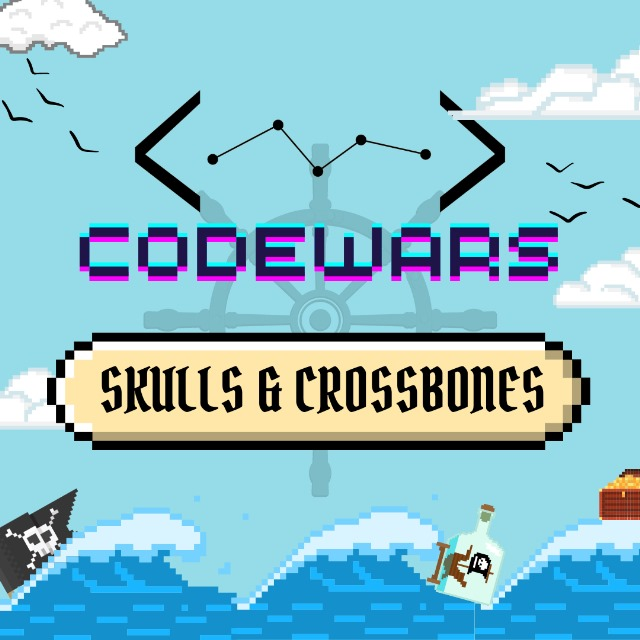

<h1>sudo rm -rf root  CodeWars-v4: Scull & Crossbones</h1>

<h2>Overview</h2>
This repository contains the codebase for our entry in the Codewars-v4 organized by WNCC at IITB. Our team achieved third place in this competition.

<h2>Competition Details</h2>
<b>Team Name:</b> sudo rm -rf root  
<b>Competition Name:</b> Sentiment Analysis Challenge  
<b>Organizer:</b> WNCC, IITB  
<b>Placement:</b> Third Place  
<b>Team Members:</b> Siddhant Mulkikar, Navya Garg, Kamyak Channa, Avinash Chaudhari  

<h2>Installation</h2>
<code>git clone https://github.com/avinashc5/sudo_rm_-rf_root_CodeWars-v4.git</code>

<h2>Requirements</h2>
Python 
tkinter 
Pygame 2.5.2  

<h2>Usage</h2>
Import the files to test into <code>main.py</code> and change the parameters to <code>G = Game((x, x), file1, file2)</code> where <code>file1</code> and <code>file2</code> are the files that you want to test and <code>x</code> is the dimension of the map
